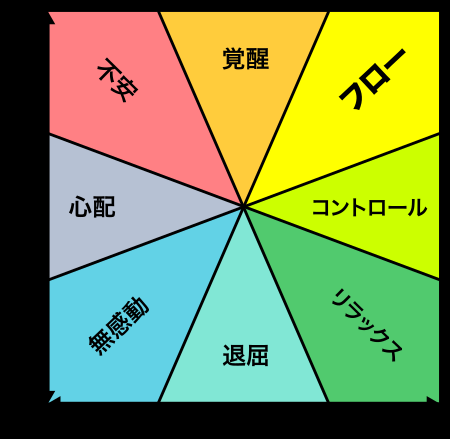

# 記事「なぜ作ったゲームが面白くならないのか？基礎にして奥義「フロー理論」 」
- https://note.com/kaerusanu/n/nc80f9523bb8e
- 20210510参照
- 20190312

- ゲームは学習の嗜好品化
    - 生存本能
- フロー理論
    - 学習から面白いと感じる条件
    - 「チャレンジしている状態」と「高度なスキルを使う状態」の重なったとき
    - 
    - ・明確な目的（予想と法則が認識できる）
    - ・専念と集中、注意力の限定された分野への高度な集中。（活動に従事する人が、それに深く集中し探求する機会を持つ）
    - ・自己に対する意識の感覚の低下、活動と意識の融合。
    - ・時間感覚のゆがみ - 時間への我々の主体的な経験の変更
    - ・直接的で即座な反応（活動の過程における成功と失敗が明確で、行動が必要に応じて調節される）
    - ・能力の水準と難易度とのバランス（活動が易しすぎず、難しすぎない）
    - ・状況や活動を自分で制御している感覚。
    - ・活動に本質的な価値がある、だから活動が苦にならない。
- アンチパターン
    - ピンチであることが認識できずいつの間にか死んでしまう
    - 行動の選択肢が多すぎる、少なすぎて介入の余地がない
        - 目的・法則の認識
        - 組み合わせ順序はセーフ
        - コンボ
    - すぐにできるすぐに効果がある成功／失敗がない
    - ゲーム自体が単純過ぎて、すぐに最適解に
        - 時間圧
        - 画面中に過剰な情報を提示することによる認知リソースの消費
        - エロやグロなど本能的に注目を集める
- 2-1を遊ぶプレイヤーは「楽勝じゃん、俺の腕が上がったんだな」と素敵な勘違い
