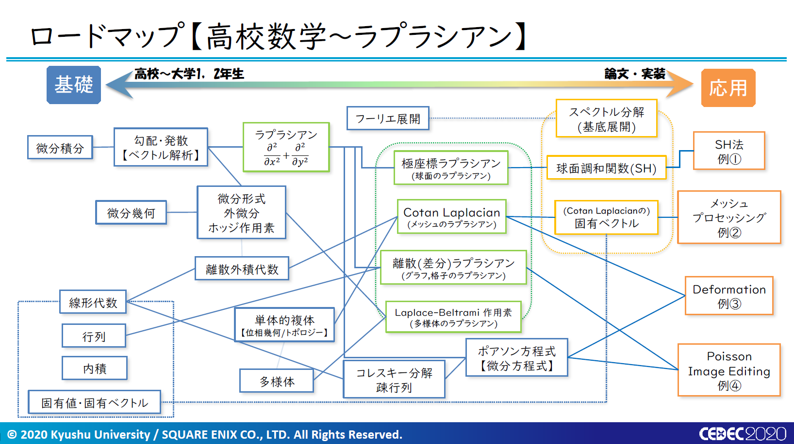
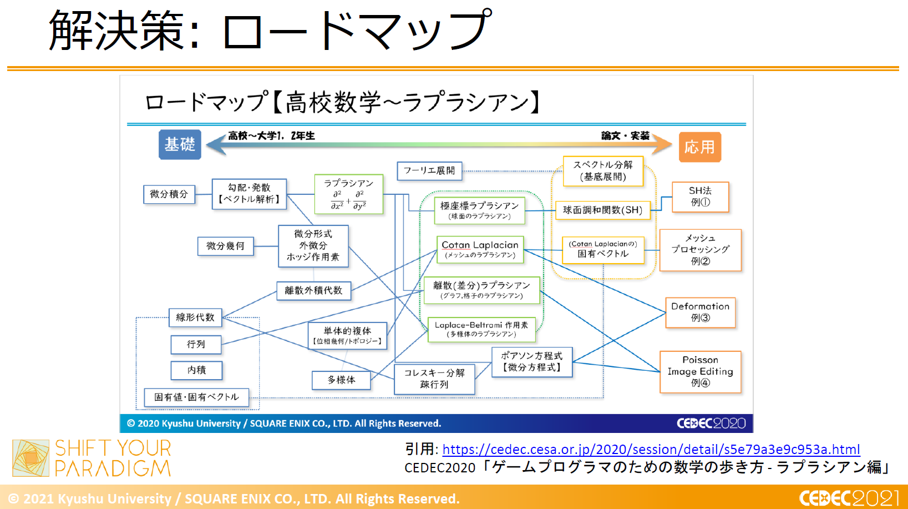

# CEDEC2021 day1
- 20210824

## VR・AI時代の新しい現実（リアル）
- ドワンゴ
- 川上氏
    - 意識と自分は別
        - ゲームあhこの知覚の補助をする
    - 自他は目的関数
        - 無数のハイパーパラメータ
        - 愛、倫理なども
    - 笑いは例外データへの反応
    - エンターテイメントは自己評価の低い目的関数の修復？？
    - 実況者のAI化の可能性

## ゲームプログラマのための数学の歩き方 - クォータニオンとリー群編
- スクウェア・エニックス
- 長谷川
- 九州大学
- 朴
    - 数学のロードマップ
        - 
        - 
    - クォータニオン
        - メリット
            - データサイズが小さい
            - 計算量が小さい
            - ジンバルロックがない
            - 球面線形補間が容易
            - 対数空間で和に持ち込める
    - リー群・リー環
        - 指数写像・対数写像
            - 積から和へ
        - SO(n)
            - n次元回転行列の集合
            - 直交行列
            - 描画可能
        - 2次元の回転の和はリー環
            - expの性質を利用
    - 行列指数関数
        - expxのテイラー展開と似たように行列Aを展開
        - $exp(リー環の元) = E\cos{\theta} + I\sin{theta}$

## ゲームプログラマのための数学の歩き方 - デュアルクォータニオン編

- スクウェア・エニックス
- 長谷川
    - デュアルクォータニオン
        - メリット
            - 雑巾絞りで縮まらない表現
    - 自動微分
        - 偏導関数のプログラムの自動導出
        - デュアルクォータニオンが必要
- 九州大学
- 落合
    - 剛体変換
        - 長さと角度を保存
        - 半直積
            - 回転と平行移動は順不同
        - 可換・非可換や体が肝
- 九州大学
- 鍛冶
    - デュアル数・二重数・デュアルクォータニオン
        - R, C, Hなどに適応
        - 自動微分、n次元剛体変換に応用
        - デュアル実数
            - 微小数をイメージした、二乗すると0になる数で拡張
            - テイラー展開すると微分後の関数が項として出現
        - デュアル複素数
            - 反可換
                - 積を入れ替えるとマイナスがつく
            - 回転と平行移動を積和で表現
            - 環
                - 逆数のない体
            - 結合法則で計算が簡単に
            - 比率で線形和を取ると剛体変換をブレンドできる
                - しかも体積を保存
                - 零の点を経由しない
            - デメリット
                - Buldingアーティファクト
                    - 曲げる点の周囲が膨らむ
                    - 軽減手法もあり

## 学習ベースの自然な音声合成技術のキャラクターボイスの応用と実運用
- スクウェア・エニックス
- 三宅
    - 音声合成の必要性
        - プレイヤーの体験に即した生成
    - 質
        - 違和感
        - 世界観
        - 他キャラとの調和
        - 状況に応じたトーン
        - 感情
    - 理想
- 東芝デジタルソリューションズ
- 倉田宜典
    - SSML
        - 音声合成マークアップ言語
    - 韻律バンクで表現力up

## 資料を資産へ、スクウェア・エニックスにおけるゲーム開発資料発掘プロジェクト [Wonder Project J編]
- スクウェア・エニックス
- 三宅
- 藤本
    - 過去の資料
        - メモリーマップ
        - 打合せ記録
        - デバッグシート
            - ビデオNo.
            - 遊び心による落書きで気が楽に
        - 不便な中での工夫

## キャラクターAIを成長させるためのGOAP意思決定システム
- スクウェア・エニックス
- ボエダ
    - GOAP
        - Goal Oriented Action Planning
    - WONDER
        - プロトタイプ
        - キャラは操作できず、ガイドするのみ
        - 手にした情報からアクション生成
            - スマートオブジェクト
            - アイテムの確率を学習し、コスト関数で行動

## キャラクターAIを成長させるためのGOAP意思決定システム
- スクウェア・エニックス
- ボエダ
    - 性格が行動決定
        - 感情
            - 短期的
        - 気分
            - 長期的
            - 感情に影響
        - 強度と残存時間
    - PADモデル
        - 快、興奮、支配
        - モーションや音声の動的変更
            - Tsugi合同会社

## 大型リリースを支えるサーバーアプリケーションの可用性の高め方 〜NieR Re[in]carnation における実践〜
- CA
- 斎藤樹
    - 負荷試験
        - 必要性
            - ユーザー数
            - 質
            - 集計
        - 正当性
        - 対策
    - 専門用語が多く、画像が少ないので視聴中止

## この1時間でゲーム実況業界の全てがわかる！？ゲーム実況の過去・現在・未来【2021年版】～「ゲームコミュニティ」を形成せよ！
- 中田朋成
- フリー
    - 歴史
        - 有野のゲームセンターCX
    - 適時適法
        - シェア機能
            - 機材不要
        - 個人対応と法人対応の明確化
    - プラットフォーム
        - YouTube
        - Twitch
        - ツイキャス
        - niconico
        - OPENREC
        - Mirrativ（ミラティブ）
        - Mildom（ミルダム）
        - Facebook Gaming
        - Mixer（閉鎖）
            - 実況者の移植に失敗
    - 芸能界の参入
    - 実況・解説
    - プロゲーマー
    - ランカーが広報
    - 説明のない実況は購入意欲を削ぐ

### オンラインリアル脱出ゲームの作り方
- 株式会社SCRAP
- 加藤隆生
    - 形態
        - 公演
        - キット
            - Web入力
        - キット＋公演
            - 店舗と通信
        - ネット完結型
            - ほぼゲーム
    - うまくいった理由
        - リアルの経験をデジタルへ
        - コロナの常識をすぐデジタル化

## クリエイターにもきっと役立つプロダクトマネジメントの基本
- Tably株式会社
- 小城
    - プロダクトマネジメント
        - 何を作るか
    - プロジェクトマネジメント
        - プロダクトをどう作るか
        - プロマネ
            - プロダクトも入れることも
    - ユーザの言いなりにならず、期待を超える

## レイトレ時代のゲームグラフィックス、地に足をつけて備えよう - NVIDIA Falcor で次世代品質のリアルタイム物理ベース照明を手軽に素早く検証する -
- バンダイナムコスタジオ
- 森重
    - レイトレのフロー
        - 絵作りやゲームエンジンが不要に
    - パストレーシング
        - 経路を確率的に探索
        - モンテカルロ法など
        - デノイズが必須
    - NVIDIA Falcor
        - 手軽
        - OSS
        - Slang, HLSL
    - 各種式
        - 説明が速すぎる

## BLUE PROTOCOLにおけるキャラクタークリエーション　～誰でも簡単！異世界転生のお手伝い～
- バンナム
- 松尾
    - 筋肉や胸に対応する服を用意している
    - ボディは絞りを複数いれたものを使い回し、他のモデルとの干渉を防ぐ
    - スカート着用時は尻を小さく
        - タイトスカートに対応
    - 防止一体型の髪は避ける
        - 前髪の質
    - 髪の揺れ
        - KawaiiPhysics
            - Epicのおかずさん
    - 眉37本、目42本、口53本、輪郭・花18本
    - 目は個性の出るバー調節が求められる
    - 唇は二重
    - メイク
        - 盛った時に不自然にならない調整
        - マスクと投影
        - UVと投影
    - ハイライトのオンオフ
    - ほくろ
        - 表情が変わっても円形になるよう調整
- 金田
    - 集団ダンスの実装
        - skeletonのみ同期
            - 100体で20fps向上
        - アニメーションしないアクセサリはStaticMesh
        - アニメーション更新頻度のLODをオン
        - アニメーションのMultiThread更新処理をOn
    - UE4でpython
    - 物理揺れ
        - RigidBodyNode
            - 回転などの物理挙動
            - 骨の階層3以下
            - 胸揺れ、アクセサリ
        - KawaiiPhysics
            - 破綻しやすいチェーン状
            - 多くの個別設定が必要なもの
            - 髪の毛、一部のアクセサリ
        - Cloth
            - 布
            - 横のつながりがあるもの

## 冴えるヒロインの作りかた　～自然言語処理AIによるキャラクター性の抽出と反映への事例紹介～
- バンナム
- 頼
    - Vision & language
        - 画像と言語の相互補完
    - 原作を学習し、らしいセリフを生成
        - 出典の参照も可能
        - 類義語にも対応
        - 担当者によってキャラブレすることを防ぐ
    - FBの会話ボットBlenderBot
        - 15億件
        - 転移に有効
    - 役割語
        - 語彙や語法の変化
        - 内容語
        - 機能語
            - 少ないのでルール化しやすい
    - 語尾が一辺倒にならないように確率化

## Unreal Engine 4から学ぶ実践的リアルタイムレイトレーシング実装
- フリー
- 古平（もんしょ）
    - Acceleration Structure
        - 別名BVH
        - レイトレのを高速化する空間分割
    - 難しいので断念

## トランスメディアゲームの可能性 ～新たな物語体験を目指して～
- エレメンツ
- 石川
    - トランスメディアゲーム
        - 石川の造語
        - トランスメディアストーリーテリングのゲーム版
            - ヘンリージェンキンズ（03）
            - フランチャイズ型
            - ARG(代替現実ゲーム)型
                - 複数のプラットフォームでようやく物語が完成
                - 例
                    - Majestic
                        - 電話、メール、SMS、FAX、Web
                    - Project:;COLD
                        - Twitter, Youtube
                        - スクエニの藤澤氏
        - ガラパゴスの微振動
            - NDROLL社
            - LINE連携
        - はやぶさ2
            - バンナム
            - LINE, ブログ, AR
            - リアルはスパイス
            - IPやデバイスが変わっても対応可能に
            - 若者は電話に抵抗がある
        - シークレットカジノ
        - 僕等のラストフェスティバル
            - SCRAP社
            - Zoom
            - 行動次第の結果を生む
                - 人間が関わることによって → AIで代替できないか
            - 2013年のZoomと繋がる
                - 消費税が古い
                - 閉店しているお店
                - 最新作を知らない
                - SMAPと共演
                - 火事で亡くなっている
                    - 火事の原因を取り除いていく
                    - Webが書き変わる
                - なぜ繋がったのかがわかっていく
        - オンラインパパラッチ
            - 世界観を伝えて服装に困らせない
            - 住所にカードが届くサプライズ
            - Twitterで投稿して伝える
                - 抵抗あるのでは？
                - 過去のすべての知見を使用
                    - チーム感
                - メディアが注目する

### 実在感溢れるキャラクターを目指して　～ワンダ、トリコで培った巨大キャラクターアニメーション５つの法則～
- ジェンデザイン
- 田中
    - 運動曲線と質量
    - 質量と最高速度は無関係
    - 走りの腰の上下動は重力加速度のカーブ
        - クラウチングスタートも同様
            - 段々落ち着いていく
    - 筋肉の強さは2乗（断面積）
        - 質量は3乗なため、大きい程動かしづらい
        - 巨人の歩きは重労働
            - 全身を利用
    - 筋肉は引くだけ
        - 固くなる
    - 自然にモノを持ちあがるとき、最適な効率で動かす
        - ロボットでは難しい
        - 頭と腕で最適な回転速度は異なる
        - 小島監督がスタジオで実演して撮影するのも納得
    - 残し
        - しなやかにする技法
        - 巨人などは使いすぎ注意
    - スロー映像では情報量が上がる
        - 相撲の肌
        - 巨人の場合、情報量の上がり過ぎに注意
    - ケレン味
        - はったりでリアリティ
    - 動けない巨人のダメージモーションは困難
        - いつでも発生
        - どんなモーションでも発生
            - 加算アニメーション
                - 関節の変化量差分を加算
                - 体重がかかっている足が動くと不自然
